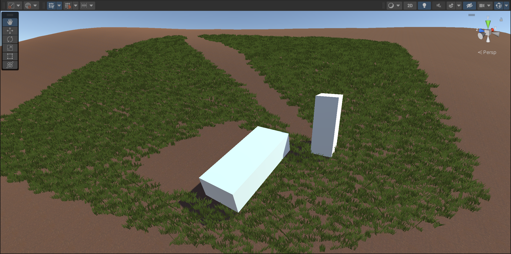

# Hi-Z

### 效果

基于Hi-Z的Grass渲染

### 原理

1. 生成Hi-Z深度图
   - 对一张全分辨率深度不断滤波，取四个像素中深度最深值
2. 读terrainData，获得每株草的世界坐标
3. 在ComputeShader中，将草的世界坐标转化为齐次裁剪空间坐标，通过其z轴和Hi-Z深度比较，进行剔除
   - 根据物体的尺寸，选择Hi-Z的mipLevel，采样得到四个深度
   - 若最远的深度能遮住该草，那么剔除
4. 使用`Graphics.DrawMeshInstancedIndirect`进行绘制

### 后续开发计划

- 更迭草的渲染
  - 密度
  - 摇摆
  - 高光
  - 阴影
- 更迭草的交互
  - 碰撞压草

### 环境

- Unity 2021.3.8f

- 注意，本项目使用Git LFS管理

### 参考

https://github.com/jackie2009/HiZ_grass_culling
